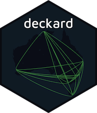
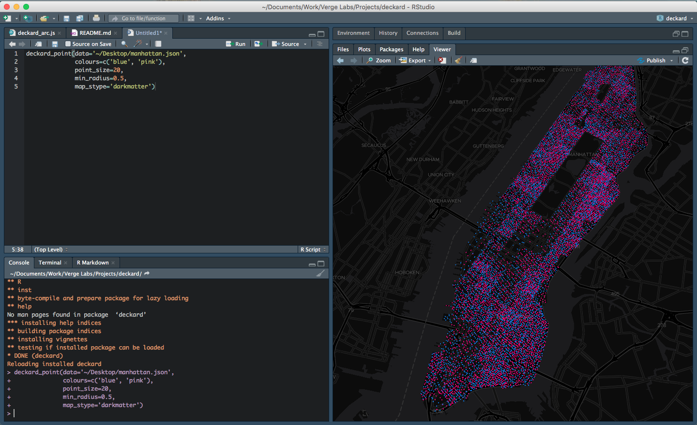

# deckard
</a>

*deckard* is a package in R that provides an interface to Uber's [deck.gl](http://deck.gl/#/) data visualisation framework. It allows users to:

* Render millions of points interactively from R
* Visualise data in the browser, providing expressive visualisations without specialised software
* Use vector tilesets instead of raster tilesets
* Create custom visualisation that of non-geospatial data

## **Warning**
**This package is still under active development and will change in the future.**

## Background
We saw the great work done at Uber with deck.gl and quickly realised it was a great tool and something we wanted to use for our own geospatial analysis (overview here) and large scale visualisations. 

To fully utilise deck.gl we wanted to integrate it with our existing workflow which is predominately in R. So we created a package that allows you to visualise data in deck.gl directly from R, either in the Viewer, Markdown Docs or using Shiny.

We can visualise our data using the existing layers provided in Deck.gl such as; line, hexagon, icon, geojson, screen grid, arc, scatter plot, point cloud, text layer and custom layers. Although the visualisations are geospatial centric they can be extended to other visualisation types, something we will be exploring in future iterations.




## Installation

```r
library(devtools)
devtools::install_github("ihansel/deckard")
```
